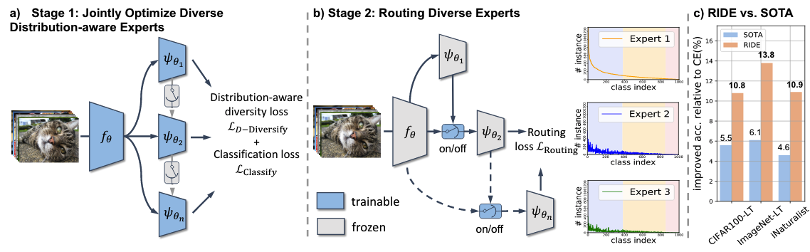

# RIDE: Long-tailed Recognition by Routing Diverse Distribution-Aware Experts

by Xudong Wang, Long Lian, Zhongqi Miao, Ziwei Liu and Stella X. Yu at UC Berkeley/ICSI and NTU

[Project Page](http://people.eecs.berkeley.edu/~xdwang/projects/RIDE/) | [PDF](http://people.eecs.berkeley.edu/~xdwang/papers/RIDE.pdf) | 
[Preprint](https://arxiv.org/abs/2010.01809) | [Citation](#citation)



This repository contains an official re-implementation of RIDE from the authors, while also has plans to support other works on long-tailed recognition. Further information please contact [Xudong Wang](mailto:xdwang@eecs.berkeley.edu) and [Long Lian](mailto:longlian@berkeley.edu).


## Supported Methods for Long-tailed Recognition:
- [x] RIDE
- [x] LDAM
- [x] Cross Entropy (CE)
- [x] Focal Loss
<!-- - [x] cRT
- [x] tau-normalization -->

## Updates
[12/2020] Initial Commit. We re-implemented RIDE in this repo. LDAM is also implemented (instruction below). We have limited support on cRT and tau-norm in `load_stage1` option and `t-normalization.py`, please look at the code comments for instructions while we are still working on it.

## Table of contents
<!-- @import "[TOC]" {cmd="toc" depthFrom=1 depthTo=1 orderedList=false} -->

<!-- code_chunk_output -->

- [RIDE: Long-tailed Recognition by Routing Diverse Distribution-Aware Experts](#ride-long-tailed-recognition-by-routing-diverse-distribution-aware-experts)
  - [Supported Methods for Long-tailed Recognition:](#supported-methods-for-long-tailed-recognition)
  - [Updates](#updates)
  - [Table of contents](#table-of-contents)
  - [Requirements](#requirements)
  - [Dataset Preparation](#dataset-preparation)
  - [How to get pretrained checkpoints](#how-to-get-pretrained-checkpoints)
  - [Training and Evaluation Instructions](#training-and-evaluation-instructions)
  - [FAQ](#faq)
  - [How to get support from us?](#how-to-get-support-from-us)
  - [Pytorch template](#pytorch-template)
  - [Citation](#citation)
  - [Acknowledgements](#acknowledgements)

<!-- /code_chunk_output -->

## Requirements
### Packages
* Python >= 3.7, < 3.9
* PyTorch >= 1.6
* tqdm (Used in `test.py`)
* tensorboard >= 1.14 (for visualization)
* pandas
* numpy

### Hardware requirements
8 GPUs with >= 11G GPU RAM are recommended. Otherwise the model with more experts may not fit in, especially on datasets with more classes (the FC layers will be large). We do not support CPU training, but CPU inference could be supported by slight modification.

## Dataset Preparation
CIFAR code will download data automatically with the dataloader. We use data the same way as [classifier-balancing](https://github.com/facebookresearch/classifier-balancing). For ImageNet-LT and iNaturalist, please prepare data in the `data` directory. ImageNet-LT can be found at [this link](https://drive.google.com/drive/u/1/folders/1j7Nkfe6ZhzKFXePHdsseeeGI877Xu1yf). iNaturalist data should be the 2018 version from [this](https://github.com/visipedia/inat_comp) repo (Note that it requires you to pay to download now). The annotation can be found at [here](https://github.com/facebookresearch/classifier-balancing/tree/master/data). Please put them in the same location as below:

```
data
├── cifar-100-python
│   ├── file.txt~
│   ├── meta
│   ├── test
│   └── train
├── cifar-100-python.tar.gz
├── ImageNet_LT
│   ├── ImageNet_LT_open.txt
│   ├── ImageNet_LT_test.txt
│   ├── ImageNet_LT_train.txt
│   ├── ImageNet_LT_val.txt
│   ├── test
│   ├── train
│   └── val
└── iNaturalist18
    ├── iNaturalist18_train.txt
    ├── iNaturalist18_val.txt
    └── train_val2018
```

## How to get pretrained checkpoints
We have a [model zoo](MODEL_ZOO.md) available.

## Training and Evaluation Instructions
### Imbalanced CIFAR 100/CIFAR100-LT
##### RIDE Without Distill (Stage 1)
```
python train.py -c "configs/config_imbalance_cifar100_ride.json" --reduce_dimension 1 --num_experts 3
```
Note: `--reduce_dimension 1` means set reduce dimension to True. The template has an issue with bool arguments so int argument is used here. However, any non-zero value will be equivalent to bool True.

##### RIDE With Distill (Stage 1)
```
python train.py -c "configs/config_imbalance_cifar100_distill_ride.json" --reduce_dimension 1 --num_experts 3 --distill_checkpoint path_to_checkpoint
```

Distillation is not required but could be performed if you'd like further improvements.

##### RIDE Expert Assignment Module Training (Stage 2)
```
python train.py -c "configs/config_imbalance_cifar100_ride_ea.json" -r path_to_stage1_checkpoint --reduce_dimension 1 --num_experts 3
```

Note: different runs will result in different EA modules with different trade-off. Some modules give higher accuracy but require higher FLOps. Although the only difference is not underlying ability to classify but the "easiness to satisfy and stop". You can tune the `pos_weight` if you think the EA module consumes too much compute power or is using too few expert.

<!--
##### cRT (load from a checkpoint without linear and freezes the pretrained parameters)
This part is not finalized and will probably change.
```
python train.py --load_crt path_to_cRT_checkpoint -c path_to_config --reduce_dimension 1 --num_experts 3
```

##### t-norm
This part is not finalized and will probably change.
Please see `t-normalization.py` for usages. It requires a hyperparemeter from the decouple paper.
-->

### ImageNet_LT
#### RIDE Without Distill (Stage 1)
##### ResNet 10
```
python train.py -c "configs/config_imagenet_lt_resnet10_ride.json" --reduce_dimension 1 --num_experts 3
```

##### ResNet 50
```
python train.py -c "configs/config_imagenet_lt_resnet50_ride.json" --reduce_dimension 1 --num_experts 3
```

##### ResNeXt 50
```
python train.py -c "configs/config_imagenet_lt_resnext50_ride.json" --reduce_dimension 1 --num_experts 3
```

#### RIDE With Distill (Stage 1)
##### ResNet 10
```
python train.py -c "configs/config_imagenet_lt_resnet10_distill_ride.json" --reduce_dimension 1 --num_experts 3 --distill_checkpoint path_to_checkpoint
```

##### ResNet 50
```
python train.py -c "configs/config_imagenet_lt_resnet50_distill_ride.json" --reduce_dimension 1 --num_experts 3 --distill_checkpoint path_to_checkpoint
```

##### ResNeXt 50
```
python train.py -c "configs/config_imagenet_lt_resnext50_distill_ride.json" --reduce_dimension 1 --num_experts 3 --distill_checkpoint path_to_checkpoint
```

#### RIDE Expert Assignment Module Training (Stage 2)
##### ResNet 10
```
python train.py -c "configs/config_imagenet_lt_resnet10_ride_ea.json" -r path_to_stage1_checkpoint --reduce_dimension 1 --num_experts 3
```

##### ResNet 50
```
python train.py -c "configs/config_imagenet_lt_resnet50_ride_ea.json" -r path_to_stage1_checkpoint --reduce_dimension 1 --num_experts 3
```

##### ResNeXt 50
```
python train.py -c "configs/config_imagenet_lt_resnext50_ride_ea.json" -r path_to_stage1_checkpoint --reduce_dimension 1 --num_experts 3
```

### iNaturalist
#### RIDE Without Distill (Stage 1)
```
python train.py -c "configs/config_iNaturalist_resnet50_ride.json" --reduce_dimension 1 --num_experts 3
```

#### RIDE With Distill (Stage 1)
```
python train.py -c "configs/config_iNaturalist_resnet50_distill_ride.json" --reduce_dimension 1 --num_experts 3 --distill_checkpoint path_to_checkpoint
```

#### RIDE Expert Assignment Module Training (Stage 2)
```
python train.py -c "configs/config_iNaturalist_resnet50_ride_ea.json" -r path_to_stage1_checkpoint --reduce_dimension 1 --num_experts 3
```

### Using Other Methods with RIDE
* LDAM: switch the config to the corresponding config
* Focal Loss: switch the loss to Focal Loss
* Cross Entropy: switch the loss to Cross Entropy Loss

### Test
To test a checkpoint, please put it with the corresponding config file.
```
python test.py -r path_to_checkpoint
```

Please see [the pytorch template that we use](https://github.com/victoresque/pytorch-template) for additional more general usages of this project (e.g. loading from a checkpoint, etc.).

## FAQ
See [FAQ](FAQ.md).

## How to get support from us?
If you have any general questions, feel free to email us at `longlian at berkeley.edu` and `xdwang at eecs.berkeley.edu`. If you have code or implementation-related questions, please feel free to send emails to us or open an issue in this codebase (We recommend that you open an issue in this codebase, because your questions may help others). 

## Pytorch template
This is a project based on this [pytorch template](https://github.com/victoresque/pytorch-template). The readme of the template explains its functionality, although we try to list most frequently used ones in this readme.

## Citation
If you find our work inspiring or use our codebase in your research, please cite our work.
```
@article{wang2020long,
  title={Long-tailed Recognition by Routing Diverse Distribution-Aware Experts},
  author={Wang, Xudong and Lian, Long and Miao, Zhongqi and Liu, Ziwei and Yu, Stella X},
  journal={arXiv preprint arXiv:2010.01809},
  year={2020}
}
```

### License
This project is licensed under the MIT License. See [LICENSE](https://github.com/frank-xwang/RIDE-LongTailRecognition/blob/main/LICENSE) for more details. The parts described below follow their original license.

## Acknowledgements
This is a project based on this [pytorch template](https://github.com/victoresque/pytorch-template). The pytorch template is inspired by the project [Tensorflow-Project-Template](https://github.com/MrGemy95/Tensorflow-Project-Template) by [Mahmoud Gemy](https://github.com/MrGemy95)

The ResNet and ResNeXt in `fb_resnets` are based on from [Classifier-Balancing/Decouple](https://github.com/facebookresearch/classifier-balancing). The ResNet in `ldam_drw_resnets`/LDAM loss/CIFAR-LT are based on [LDAM-DRW](https://github.com/kaidic/LDAM-DRW). KD implementation takes references from CRD/[RepDistiller](https://github.com/HobbitLong/RepDistiller).
